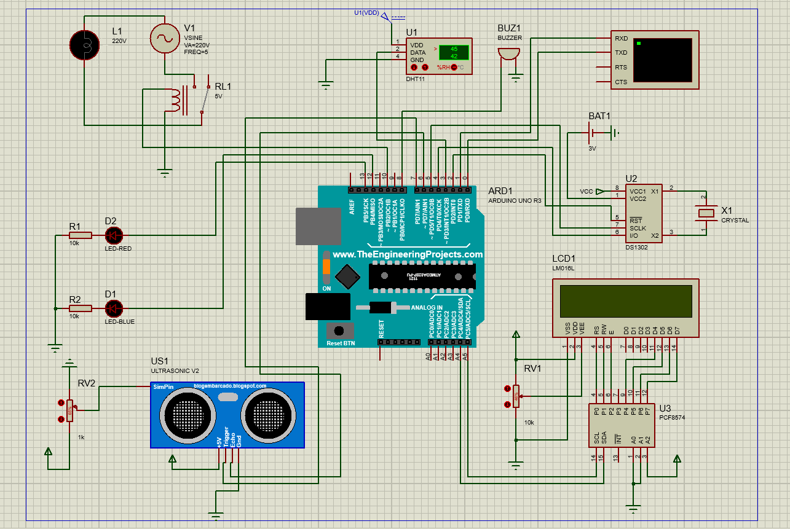

# Microprocessor control system of the incubator

## Program testing

## About
Is an arduino controlled incubator for chicken's eggs. 
 It's purpose is to keep temperature and humidity at defined values, so that the eggs are incubated and the chicks finally hatch after some days.

It might as well be used to incubate other things than chicken's egg like other kinds of eggs (ducks, ...), 
 or cultures of bacteria or fungus i.e. to make yoghurt.

## Components
In this project, I used components such as: 
1. Arduino UNO R3;
2. Two LED (blue, red);
3. Resistors;
4. LCD1602 or 1602 character-type liquid crystal display with I2C adapter;
5. Relay;
6. DHT11 digital temperature and humidity sensor;
7. Bulb;
8. Sinusoidal voltage source;
9. Buzzer;
10. Real time clock DS1302;
11. Ultrasonic sensor HC-SR04;

## Features
☑️ Turn on the camera heating system and the humidity maintenance system,  maintain the temperature at 38◦С for 5 hours,  then maintain the temperature at 28◦С for 30 minutes, repeat this way;
 ☑️ 50% humidity is kept constant;
 ☑️ Ensure measurement of temperature and humidity values with a periodicity of 5 minutes;
 ☑️ Display of temperature and humidity values;
 ☑️ Displaying the current time;
 ☑️ If the temperature/humidity deviates from the set by 5%, light the LEDs that are responsible for temperature and humidity;
 ☑️ In case of temperature deviation up to 20◦С, give a short sound signal;
 ☑️ In the event of a signal from the motion sensor (chicken hatching), give a sound signal for 1 minute with a frequency of 1 kHz.

## Launch guide
To run this project you will need to Arduino Uno R3 and other components specified in paragraph [Components](#Components).
 
## Schemes project
### Fritzing scheme

### Proteus scheme

